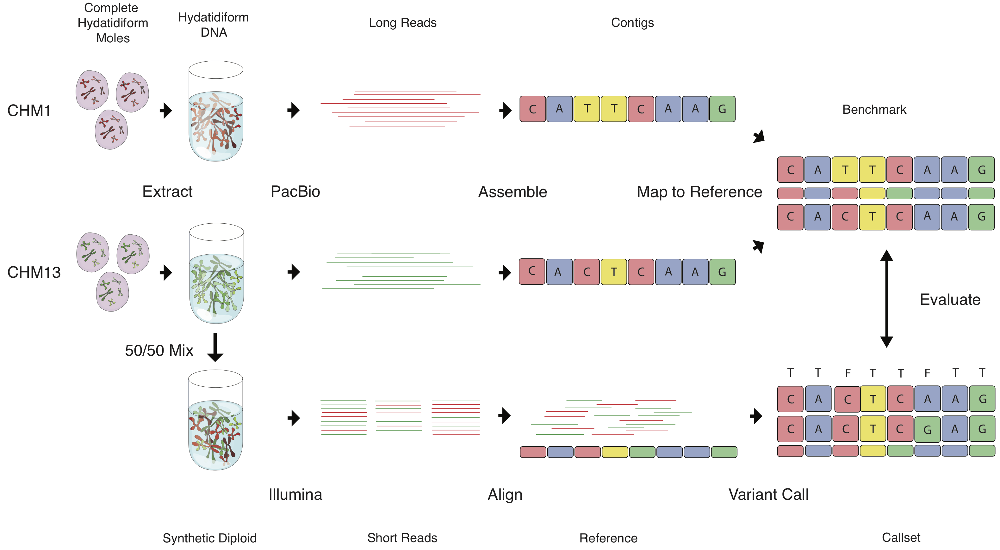

## Getting Started
```sh
# Download and install evaluation suite (Linux only)
curl -L https://github.com/lh3/CHM-eval/releases/download/v0.4/CHM-evalkit-20180221.tar \
    | tar xf -
# Call CHM1-CHM13 variants in the GRCh37 coordinate (will take a while...)
wget -qO- ftp://ftp.sra.ebi.ac.uk/vol1/ERA596/ERA596361/bam/CHM1_CHM13_2.bam \
    | freebayes -f hs37.fa - > CHM1_CHM13_2.raw.vcf
# Filter (use your own filters if you like)
CHM-eval.kit/run-flt -o CHM1_CHM13_2.flt CHM1_CHM13_2.raw.vcf
# Distance-based evaluation
CHM-eval.kit/run-eval -g 37 CHM1_CHM13_2.flt.vcf.gz
more CHM1_CHM13_2.flt.summary
# Evaluating allele and genotype accuracy (Java required)
CHM-eval.kit/rtg -o hs37.sdf hs37.fa   # if you haven't done this before
CHM-eval.kit/run-eval -g 37 -s hs37.sdf CHM1_CHM13_2.flt.vcf.gz
more CHM1_CHM13_2.flt.rtg.summary
```

## Introduction

CHM-eval, aka Syndip, is a benchmark dataset for evaluating the accuracy of
small variant callers. It is constructed from the PacBio assembilies of two
independent [CHM][CHM] cell lines using procedures largely orthogonal to the
methodology used for short-read variant calling, which makes it more
comprehensive and less biased in comparison to existing benchmark datasets. The
following figure briefly explains how this dataset was generated:



The truth data can be downloaded from the [release page][release]. The package
contains the list of confident regions, *phased* variant calls including
thousands of long insertions/deletions, and evaluation scripts (see below).
Illumina short reads sequenced from the two cell lines and from the
experimental mixture of the two cell lines are availble via project
[PRJEB13208][ena] at ENA.

```
CHM-eval.kit
|-- 00README.md              # this file
|-- 01ori
|   |-- func-37d5.bed.gz -> func-37m.bed.gz
|   |-- func-37m.bed.gz      # coding and conserved regions (from EnsEMBL) in GRCh37
|   |-- func-38.bed.gz       # coding and conserved regions in GRCh38
|   |-- hybrid.m37d5.bed.gz  # confident regions including poly-A
|   |-- hybrid.m37m.bed.gz
|   `-- hybrid.m38.bed.gz
|-- RTG-LICENSE.txt
|-- RTG.jar                  # rtg-tools v3.8.4 (for evaluating allele/genotype accuracy)
|-- full.37d5.bed.gz         # whole-genome confident regions excluding poly-A
|-- full.37d5.vcf.gz         # whole-genome phased variant calls, including filtered
|-- full.37m.bed.gz
|-- full.37m.vcf.gz
|-- full.38.bed.gz
|-- full.38.vcf.gz
|-- func.37d5.bed.gz         # intersection of full.37d5.bed.gz and 01src/func-37d5.bed.gz
|-- func.37m.bed.gz
|-- func.38.bed.gz
|-- hapdip.js                # script for evaluating distance-based accuracy
|-- htsbox                   # htsbox-r345; auxiliary tool
|-- k8                       # k8 javascript shell, for running hapdip.js
|-- rtg                      # rtg portal script
|-- rtg.cfg
|-- run-eval                 # key evaluation script
|-- sdust30-37d5.bed.gz      # low-complexity regions identified with SDUST at T=30
|-- sdust30-37m.bed.gz -> sdust30-37d5.bed.gz
|-- sdust30-38.bed.gz
|-- um35-hs37d5.bed.gz       # universal mask for hs37d5; for 35bp reads
`-- um75-hs37d5.bed.gz
```

[CHM]: https://www.ncbi.nlm.nih.gov/pmc/articles/PMC4729092/
[ena]: https://www.ebi.ac.uk/ena/data/view/PRJEB13208
[release]: https://github.com/lh3/CHM-eval/releases
